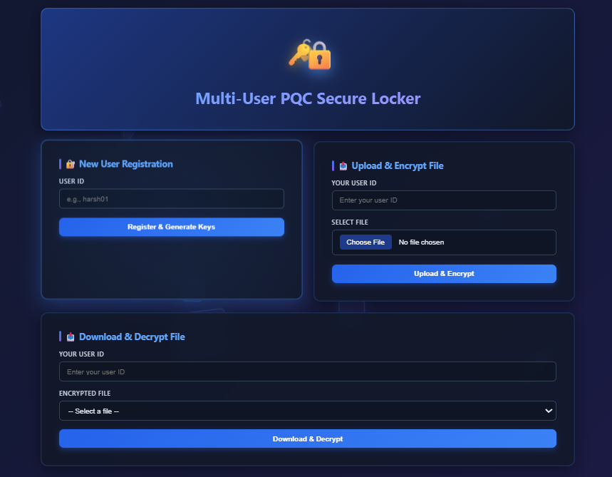

# 🔐 PQC LOCKER  
### **Multi-User Secure File Encryption System (AES-256 EAX)**

A modern, secure, and user-friendly locker system that encrypts files using **per-user AES-256 keys**, ensuring confidentiality, integrity, and tamper-protection.

---

# 📸 UI Preview

A glimpse of the secure locker interface:

---

# 🚀 Features

- 🔑 **AES-256 per-user key generation**
- 🔐 **EAX-mode authenticated encryption**
- 📤 Secure file upload + encrypted storage
- 📥 Automatic decryption on download
- 🛡 Authentication tag verification (data tamper-proof)
- 🧹 Temporary decrypted file auto-cleanup
- 🗂 Follows MVC-inspired project structure
- 🎨 Fully styled modern UI layout
- ⚙ Production-ready architecture (KMS, Vault, JWT compatible)

---

# 🧰 Tech Stack

| Component | Technology |
|----------|------------|
| Backend | Flask (Python) |
| Crypto Engine | PyCryptodome AES-256 |
| Mode | AES-EAX (AEAD) |
| UI | HTML + CSS (Jinja Templates) |
| Deployment | Gunicorn + Nginx |
| Storage | Local (prototype), S3-ready |

---

# 📁 Folder Structure
pqc_locker/
│── app.py # Flask Controllers
│── data/ # Keys + Encrypted files
│── views/ # HTML templates (UI)
│── static/ # CSS / JS / Assets
│── services/ # Encryption logic
│── models/ # Future DB models
│── README.md
│── requirements.txt
│── LICENSE

---

# 🔧 Installation

### 1️⃣ Clone the repository

git clone https://github.com/<your-username>/pqc_locker.git
cd pqc_locker

### 2️⃣ Create a virtual environment
python -m venv venv
venv\Scripts\activate     # Windows
source venv/bin/activate  # Linux/Mac

### 3️⃣ Install dependencies
pip install -r requirements.txt

### 4️⃣ Run the app
python app.py

###  Now visit →

###🔐 Encryption Process (AES-256 EAX)

PQC Locker uses AEAD (Authenticated Encryption with Associated Data)

The encrypted file is stored in this format:-
[ NONCE | TAG | CIPHERTEXT ]

📬 API Endpoints (Developer Friendly)

▶ Register User

user_id=<username>

▶ Upload + Encrypt

user_id=<username>
file=<file>

▶ Download + Decrypt

user_id=<username>
filename=<original>

🏭 Production Deployment Guide

To upgrade to enterprise-grade security, add: ------ 

🔐 Key Management

AWS KMS

HashiCorp Vault (Transit engine)

Azure Key Vault

🛡 Authentication

JWT Access Tokens

Role-based access

🚀 Infrastructure

Docker containerization

Nginx reverse proxy

HTTPS with Let's Encrypt

🧵 Logging + Monitoring

Audit trails

IP logging

Fail2ban

CloudWatch / ELK stack

🗂 Storage Upgrade

AWS S3 bucket with SSE-KMS

Encrypted key storage

📜 License

This project is published under the MIT License.
Feel free to modify or use in your projects.

👨‍💻 Author

Harsh Anand
Full-Stack Developer | AI | Secure Systems

GitHub: https://github.com/harsh21anand

⭐ Support

If you found this useful, please ⭐ star the repository.
It motivates me to continue building secure developer tools.......

---

